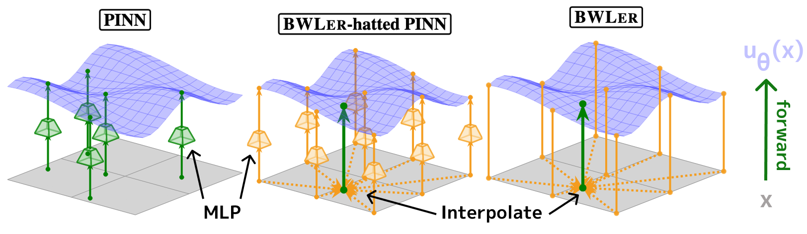

<div align="center">
  

  <br/>

  <a href="LICENSE">
    
  </a>
  <a href="https://arxiv.org/abs/2506.23024">
    
  </a>
</div>

<h1 align="center">BWLer: Barycentric Weight Layer Elucidates a Precision-Conditioning Tradeoff for PINNs</h1>

<p align="center">
  This repository contains code for the following paper:
</p>

<blockquote align="center">
  <b>BWLer: Barycentric Weight Layer Elucidates a Precision-Conditioning Tradeoff for PINNs</b><br/>
  Jerry Liu, Yasa Baig, Denise Hui Jean Lee, Rajat Vadiraj Dwaraknath, Atri Rudra, Chris Ré.<br/>
  <b>Best Paper Award</b> at the <i>Workshop on the Theory of AI for Scientific Computing (TASC) @ COLT 2025</i><br/>
  <small><a href="https://arxiv.org/abs/2506.23024"><em>[Read the paper]</em></a></small>
</blockquote>

<div style="margin-top: 0.75em;"></div>

<p>
  <b>BWLer</b> replaces or augments physics-informed neural networks with <i>barycentric polynomial interpolants</i>, towards higher-precision solutions to partial differential equations. BWLer comes in two variants:
</p>

<ul>
  <li><b>BWLer-hatted MLP:</b> adds a global interpolation layer on top of an existing neural network architecture.</li>
  <li><b>Explicit BWLer:</b> removes the neural network entirely, and instead directly optimizes the function values at BWLer's interpolation nodes.</li>
</ul>


<p>
  See our accompanying blog posts for more details:
  <ul>
    <li><a href="https://hazyresearch.stanford.edu/blog/2025-07-07-bwler-p1">Part 1: PDEs, PINNs, and the Precision Gap</a></li>
    <li><a href="https://hazyresearch.stanford.edu/blog/2025-07-07-bwler-p2">Part 2: Navigating a Precision–Conditioning Tradeoff for PINNs</a></li>
  </ul>
</p>


<div align="center">
  

  <p style="max-width: 700px; margin-top: 0.5em;">
    <i>Figure:</i> Standard PINN evaluates an MLP throughout the domain (left). <b>BWLer</b> interpolates globally based on values at discrete grid nodes; <b>BWLer-hatted MLP</b> obtains values using an MLP (middle), <b>explicit BWLer</b> parameterizes values directly (right).
  </p>
</div>


## Dependencies
Install dependencies with
```
conda create -n "bwler" python=3.11
conda activate bwler
pip install -e .
```


## Code structure
The code is organized as follows:
- [scripts/](scripts/): contains scripts for running the experiments:
  - [scripts/pdes/](scripts/pdes/): PDE experiment submission scripts
  - [scripts/ablations/](scripts/ablations/): ablation study scripts
- [src/experiments/](src/experiments/): contains the main experiment framework, including the PDE problem definitions
- [src/models/](src/models/): contains the two BWLer variants:
  - [src/models/interpolant_nd.py](src/models/interpolant_nd.py): explicit BWLer
  - [src/models/mlp_interpolant_nd.py](src/models/mlp_interpolant_nd.py): BWLer-hatted MLP
  - [src/models/mlp.py](src/models/mlp.py): standard MLP
- [src/optimizers/](src/optimizers/): contains the Nyström-Newton CG optimizer


## Getting started

- To try BWLer on the five benchmark PDEs from our paper, run the scripts in [scripts/pdes/](scripts/pdes/).
- To incorporate new PDE problems into the repo, create a new class extending [base_pde.py](src/experiments/pdes/base_pde.py). Simply specify the domain in the `__init__` and PDE loss terms in `get_loss_dict`. Please refer to [convection.py](src/experiments/pdes/simple/convection.py) for a simple example, and [poisson_2d_cg.py](src/experiments/pdes/benchmarks/poisson_2d_cg.py) for an example with an irregular domain.
- To try different optimizers or training techniques, refer to [base_fcn.py](src/experiments/base_fcn.py) for the optimizer initialization and [base_pde.py](src/experiments/pdes/base_pde.py) for the main training loops. We currently only support Adam and [NNCG](https://arxiv.org/abs/2402.01868), but we think there's a lot more to do towards higher-precision optimizers with BWLer!


## Citation
If you find this work useful, please cite it as follows:
```
@misc{liu2025bwlerbarycentricweightlayer,
  title={BWLer: Barycentric Weight Layer Elucidates a Precision-Conditioning Tradeoff for PINNs}, 
  author={Jerry Liu and Yasa Baig and Denise Hui Jean Lee and Rajat Vadiraj Dwaraknath and Atri Rudra and Chris Ré},
  year={2025},
  eprint={2506.23024},
  archivePrefix={arXiv},
  primaryClass={cs.LG},
  note={Presented at the Workshop on the Theory of AI for Scientific Computing (TASC) @ COLT 2025},
  url={https://arxiv.org/abs/2506.23024}
}
```

